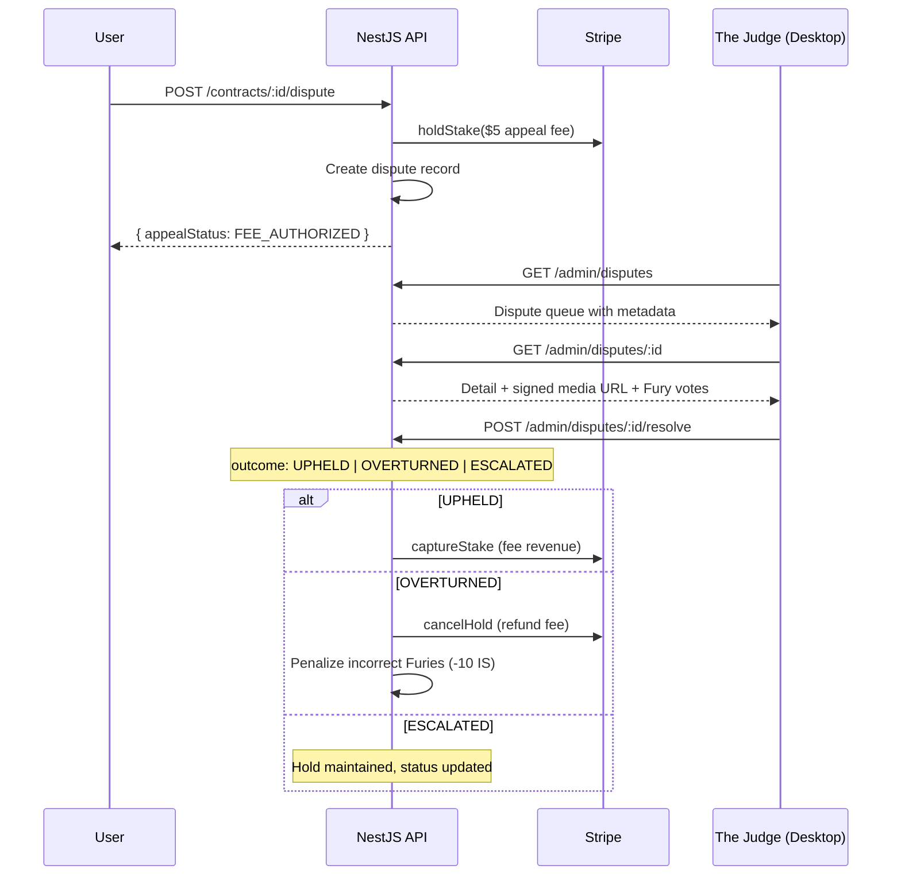

# Phase Gamma + Delta — Walkthrough

## Summary

Two complete phases shipped in this session:

- **Phase Gamma (The Panopticon):** Adversarial verification network — proofs pipeline, Fury routing, honeypot injection, video workbench, mobile camera capture, R2 lifecycle rules.
- **Phase Delta (The Arena):** Social dynamics and dispute resolution — pHash dedup, Judge's Gavel, Tavern Board, public feed, Gatekeeper scan.

| Metric | Gamma | Delta | Total |
|--------|-------|-------|-------|
| Commits | `e2adf08` | `4f4a8a2` | 2 |
| Files changed | 14 | 15 | 29 |
| Insertions | 1,031 | 1,007 | 2,038 |
| Deletions | 70 | 122 | 192 |
| New files | 4 | 5 | 9 |

---

## Phase Delta Changes

### API — Fraud Detection

| File | Change |
|------|--------|
| [proofs.controller.ts](file:///Users/4jp/Workspace/organvm-iii-ergon/peer-audited--behavioral-blockchain/src/api/src/modules/proofs/proofs.controller.ts) | pHash dedup check in `confirmUpload` — downloads media, computes hash, rejects duplicates with `409 CONFLICT` |
| [proofs.module.ts](file:///Users/4jp/Workspace/organvm-iii-ergon/peer-audited--behavioral-blockchain/src/api/src/modules/proofs/proofs.module.ts) | Added `PHashService` to providers |
| [r2.service.ts](file:///Users/4jp/Workspace/organvm-iii-ergon/peer-audited--behavioral-blockchain/src/api/services/storage/r2.service.ts) | Added `downloadFile()` for server-side media retrieval |
| [003_proof_hashes.sql](file:///Users/4jp/Workspace/organvm-iii-ergon/peer-audited--behavioral-blockchain/src/api/database/migrations/003_proof_hashes.sql) | **[NEW]** `proof_hashes` table with pHash index |

### API — Dispute Resolution

| File | Change |
|------|--------|
| [dispute.service.ts](file:///Users/4jp/Workspace/organvm-iii-ergon/peer-audited--behavioral-blockchain/src/api/services/escrow/dispute.service.ts) | Full rewrite: `initiateAppeal`, `getDisputeQueue`, `getDisputeDetail`, `resolveDispute` (UPHELD/OVERTURNED/ESCALATED) |
| [admin.controller.ts](file:///Users/4jp/Workspace/organvm-iii-ergon/peer-audited--behavioral-blockchain/src/api/src/modules/admin/admin.controller.ts) | 9 endpoints: dispute queue/detail/resolve, user profile, integrity adjust, stats with pendingDisputes |
| [004_disputes.sql](file:///Users/4jp/Workspace/organvm-iii-ergon/peer-audited--behavioral-blockchain/src/api/database/migrations/004_disputes.sql) | **[NEW]** `disputes` table with appeal status tracking |

### API — Public Feed

| File | Change |
|------|--------|
| [feed.controller.ts](file:///Users/4jp/Workspace/organvm-iii-ergon/peer-audited--behavioral-blockchain/src/api/src/modules/feed/feed.controller.ts) | **[NEW]** `GET /feed` + `GET /feed/stream` (SSE), anonymized events |
| [feed.module.ts](file:///Users/4jp/Workspace/organvm-iii-ergon/peer-audited--behavioral-blockchain/src/api/src/modules/feed/feed.module.ts) | **[NEW]** Module registration |
| [app.module.ts](file:///Users/4jp/Workspace/organvm-iii-ergon/peer-audited--behavioral-blockchain/src/api/src/app.module.ts) | Added `FeedModule` to imports |

### Web — Tavern Board

| File | Change |
|------|--------|
| [Leaderboard.tsx](file:///Users/4jp/Workspace/organvm-iii-ergon/peer-audited--behavioral-blockchain/src/web/components/Leaderboard.tsx) | Tier badges (💎/🥇/🥈/🥉), animated ranks, period filters, Fury of the Week spotlight |

### Mobile — Activity Feed

| File | Change |
|------|--------|
| [TavernFeed.tsx](file:///Users/4jp/Workspace/organvm-iii-ergon/peer-audited--behavioral-blockchain/src/mobile/components/TavernFeed.tsx) | SSE `/feed/stream` integration, event type icons, connection indicator, relative timestamps |

### DevOps

| File | Change |
|------|--------|
| [gatekeeper-scan.sh](file:///Users/4jp/Workspace/organvm-iii-ergon/peer-audited--behavioral-blockchain/scripts/gatekeeper-scan.sh) | **[NEW]** Validation Gate #4: scans for forbidden gambling terms |

### Documentation

| File | Change |
|------|--------|
| [CHANGELOG.md](file:///Users/4jp/Workspace/organvm-iii-ergon/peer-audited--behavioral-blockchain/CHANGELOG.md) | Added v0.3.0 (Gamma) and v0.4.0 (Delta) |
| [roadmap.md](file:///Users/4jp/Workspace/organvm-iii-ergon/peer-audited--behavioral-blockchain/docs/roadmap.md) | Marked Phases Gamma + Delta complete |

---

## Dispute Resolution Flow

---

## Remaining: Phase Omega

The final roadmap phase targets B2B SaaS:
- Enterprise CRM connectors (Salesforce/HubSpot)
- Consumption billing
- Anonymization layer for corporate HR
