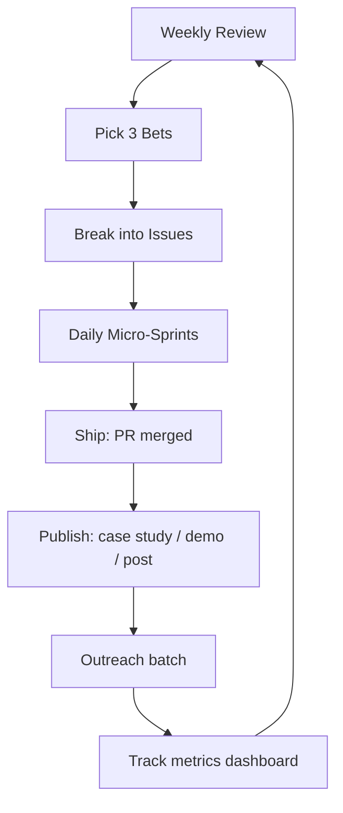
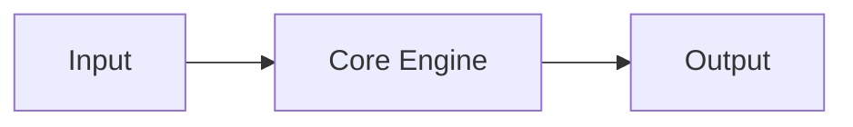
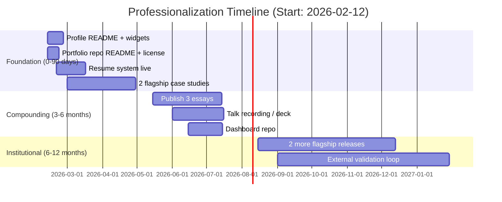

# Full Professionalization Mode Plan for 4444j99

## Executive summary

Your current public-facing ecosystem already shows **rare differentiation**: a coherent philosophical/artistic thesis (“systems that build themselves”), a **systems-of-systems architecture** (the eight-organ model), and strong evidence that you understand “professional repo” expectations at a high level via heavy org-wide automation and security patterns (especially in the org-level `.github` repo). That combination is uncommon and valuable.

What’s missing is not “more ambition” — it’s a **translation layer + consistent professional signals** that help unfamiliar audiences (recruiters, collaborators, curators, grant reviewers, hiring managers) quickly answer four questions in under 90 seconds:

1) *What do you do (in normal words)?*  
2) *What can you ship (proof, demos, metrics, scope)?*  
3) *How do I evaluate you (case studies, references, talks, writing, standards)?*  
4) *How do I contact / hire / collaborate with you right now?*

The strongest path to “full professionalization mode” is a **two-lane presence**:

- **Lane A: Razzle & dazzle (tasteful)** — beautiful, dynamic widgets and visual artifacts that make people stop scrolling (profile README infographics, generated diagrams, live visual demos), using reliable tooling like `lowlighter/metrics`, plus a curated aesthetic. citeturn7search1turn6search2turn6search0  
- **Lane B: Professional trust (non-negotiable)** — clear role positioning, crisp case studies, consistent repo hygiene, security posture, and “how to engage” surfaces (resume, portfolio, contact, licensing, contribution/docs patterns). GitHub itself emphasizes profile setup and profile README as first-class profile customization. citeturn0search2turn0search3

Because your target industry/seniority/market are unspecified, this plan is designed as a **modular professionalization system** with three positioning options you can choose from (or run in parallel with different landing pages):

- **Option 1: Creative Technologist / Systems Artist** (grants, residencies, studios, R&D labs, interactive media)  
- **Option 2: Agentic / AI Systems Engineer & Architect** (labs, startups, infrastructure-heavy teams, research engineering)  
- **Option 3: DevEx / CI-CD / Governance & Tooling Lead** (platform engineering, org-wide automation, security baseline work, “make 80 repos behave”) — strongly supported by the org-wide `.github` repo concept. citeturn0search1turn3search0  

## Synthesized audit of the three GitHub repositories

### What the repos demonstrate

**4444J99/4444J99 (profile repository)**  
This is your *identity nucleus*. GitHub supports a special “profile README” shown on your profile when the repository matches your username. citeturn0search2turn0search3  
Strength: strong thesis, strong conceptual integrity, strong navigation into the eight-organ ecosystem.  
Gap: it is optimized for people who already “speak your language.” It needs a second, more conventional “professional interface” layered on top (skills, stack, proof, contact, “open to,” and a short portfolio/resume jump).

**4444J99/portfolio**  
This is your *public showroom* implemented as an Astro site with a GitHub Pages deployment workflow. GitHub supports custom workflows for Pages, including separating build and deploy jobs. citeturn19search2turn2search2  
Strength: you already have a coherent structure to present dozens of projects, plus interactive generative elements; it reads like a “catalog of systems,” not a random project list.  
Gap: the repo’s README is still the default template; that’s a credibility leak (it signals “unfinished” to technical reviewers even if the site is excellent). Also the repo likely needs “portfolio-grade” professional signals: license clarity, accessibility checks, performance/SEO basics, and a stable domain/redirect story.

**organvm-i-theoria/.github**  
This is the *enterprise-grade backbone* repo. GitHub supports organization-wide “community health files” stored in a public `.github` repository, which can provide defaults (e.g., `CONTRIBUTING.md`, `CODE_OF_CONDUCT.md`, issue templates) across repos. citeturn0search1turn0search5  
Strength: demonstrates advanced CI/CD, security scanning posture, and automation discipline (including SHA-pinning patterns consistent with GitHub’s own security hardening recommendations for third‑party Actions). citeturn1search0turn1search6  
Gap: “template placeholders” and complexity risk — it can look like an internal platform that’s overbuilt unless you present it as a deliberate flagship artifact (with an explainer and measured outcomes). Also, sustaining this across multiple orgs requires an explicit “maintenance model” and dashboard.

### Cross-repo comparison table

| Attribute | 4444J99/4444J99 (Profile) | 4444J99/portfolio | organvm-i-theoria/.github |
|---|---|---|---|
| Primary role in your ecosystem | Identity + navigation hub | Public portfolio site + demos | Org-wide standards, automation, security |
| Strongest professional signal | Clear thesis + unique architecture | “System catalog” presentation; deploy-ready site | “Real DevOps governance” credibility at scale |
| Audience fit | High-context readers | Mixed audience (technical + non-technical) | Highly technical reviewers, collaborators |
| “Trust cues” (badges, releases, etc.) | Currently minimal | Deploy workflow exists; README needs rewrite | Strong CI/security posture implied; aligns with modern hardening guidance citeturn1search0 |
| Main weaknesses to fix | Lacks conventional “hireable interface” | README + licensing + portfolio SEO/accessibility polish | Risk of looking like a template labyrinth; needs framing + metrics |
| Highest-leverage improvement | Add “Professional front door” section + widgets | Turn repo into a credible productized site package | Publish an explainer + audit dashboard + reuse story (why it matters) |
| Best-fit “razzle & dazzle” | Metrics infographics + curated visual widgets | Embedded demos, motion, screenshots, short clips | Diagrams, compliance scorecards, org health visuals |

## Missing competencies, credentials, portfolio elements, and professional signals

This is organized as **signals that audiences use to make decisions fast**. The goal is not “more stuff,” but **less ambiguity**.

### Professional signals most likely missing or under-emphasized

**Role clarity (positioning)**  
You have a rare conceptual frame; now add **two canonical titles** you can stand behind, and attach them everywhere consistently: profile header, portfolio hero, resume header, and outbound messages. This reduces cognitive load (especially for recruiters/hiring managers).

**Proof packaging (case studies, demos, outcomes)**  
Projects are listed, but “professional mode” requires **case studies** with:
- problem → approach → constraints → implementation → results → tradeoffs  
- a 30-second demo artifact (gif/video/screenshots)  
- one small metric (performance, scale, test count, adoption, time saved)  
“Keep a Changelog” exists because humans evaluate change and continuity; similarly, people evaluate professionals by narrative continuity and measurable outcomes. citeturn12search1

**Resume/ATS pipeline that matches your identity**  
For an academic/engineer/artist-hybrid, “resume as code” is a natural fit. A strong baseline is **JSON Resume** (portable schema) or **YAML-to-PDF** via tools like RenderCV; both support version control and reproducibility. citeturn5search0turn14search4  
Alternative: Reactive Resume (privacy-minded, self-hostable, shareable, trackable). citeturn14search0turn14search2

**GitHub hygiene & governance**  
At minimum: licensing clarity, release semantics (SemVer), changelog discipline, and conventional commits when you want automation to help you rather than fight you. citeturn11search0turn11search4turn12search1  
For org-scale repos, align baseline governance and security controls with an external standard like the **OSPS Baseline** from entity["organization","Open Source Security Foundation (OpenSSF)","linux foundation security org"] — this creates credibility with security-aware evaluators. citeturn2search1turn2search4

**Security & supply-chain professionalism (especially if you showcase CI/CD)**  
GitHub explicitly recommends hardening Actions usage (SHA pinning for third‑party Actions, careful auditing, least privilege). citeturn1search0  
Also: define minimal `GITHUB_TOKEN` permissions explicitly; GitHub docs describe fine-grained `permissions` behavior, including how unspecified scopes default to `none` once any permission is set. citeturn1search7  
Branch protection / rulesets are now a major professional signal; GitHub documents enforceable rules like requiring signed commits, PR requirements, and status checks. citeturn3search0

**Credential signals (optional but helpful; choose strategically)**  
Because you’re building heavily on automation/governance, one fast-win signal is the GitHub certification track (Foundations + Actions). These appear on entity["company","Microsoft","software company"]’s Learn credential pages and map well to public evidence you can generate in repos. citeturn9search4turn9search3

### Missing “professional presence” components (outside GitHub)

- LinkedIn and a one-page PDF resume that match your chosen positioning (Option 1/2/3).  
- A stable personal domain strategy (you already hint at it via email) and canonical URLs.  
- A repeatable “content + networking cadence” so your presence doesn’t decay.

## Razzle-and-dazzle widget blueprint for your GitHub profile

The objective here is **beautiful, alive, and technically credible**, without turning your profile into a noisy dashboard.

### Core principles for “professional razzle”
- **One aesthetic system** (fonts/colors/spacing) across profile README + portfolio.  
- **Three visual anchors max** on the first screen: a hero mark, one infographics panel, one “proof strip.”  
- **Dark/light support** (professional polish). Many widget projects explicitly support dark mode switching via `<picture>` elements or GitHub theme tags. citeturn6search2turn6search0  

image_group{"layout":"carousel","aspect_ratio":"16:9","query":["GitHub profile README widgets metrics infographic lowlighter","GitHub contribution snake SVG Platane snk","GitHub readme stats card examples","GitHub profile README design minimal professional"],"num_per_query":1}

### Recommended widget stack (reliable + high signal)

**Tier 1 (high reliability, high value)**  
1) **Metrics infographics**: `lowlighter/metrics` (47 plugins, 335 options) — can render “isometric calendar,” languages, lines of code changed, etc. citeturn7search1turn7search4  
2) **Stats card**: `github-readme-stats` (themes, transparent options, theme switching strategies). citeturn6search2  
3) **Pinned repos (GitHub-native)**: curate 6 pinned repos as the “portfolio shelf.” GitHub highlights pinned repos as a core profile surface. citeturn8search1  

**Tier 2 (high delight, moderate seriousness)**  
4) **Contribution snake** (`Platane/snk`) — visually memorable; keep it below the fold so it adds delight without crowding the pitch. citeturn6search0  
5) **Streak widget** (use carefully; can be gamified). If you use it, consider self-hosting for reliability. citeturn6search1  

### A professional profile README layout that preserves your identity

**Above the fold (first screen)**  
- One-line title (your chosen role) + your thesis in plain words  
- “Now” line: what you’re building this quarter  
- 3 links max: Portfolio, Resume, Email

**Second screen**  
- “Flagship systems” (3 case-study links) + one-liner impact  
- One “metrics strip” image (from `lowlighter/metrics`)

**Third screen**  
- A curated “proof of practice” list: talks, essays, releases, demos  
- Optional delight widget (snake)

### Copy-paste-ready widget skeleton (customize later)

```md
<!-- HERO -->
# 4444j99 — Creative Technologist / Systems Architect

I build autonomous creative systems and treat governance as an artistic medium.

**Now:** Shipping 2 flagship case studies + tightening org-wide automation into a reusable, documented standard.

- Portfolio: https://4444j99.github.io/portfolio/
- Resume:   https://4444j99.github.io/portfolio/resume/
- Email:    hello@4444j.dev

<!-- METRICS (generated by GitHub Actions) -->
<picture>
  <source media="(prefers-color-scheme: dark)" srcset="./assets/metrics-dark.svg">
  <source media="(prefers-color-scheme: light)" srcset="./assets/metrics.svg">
  
</picture>

<!-- STATS CARD (optional) -->

```

To generate the Metrics SVG daily, you’d typically run a scheduled workflow in the profile repo (your username repo). The metrics action is designed for this “embed everywhere” use case. citeturn7search1turn7search4  

## Prioritized professionalization roadmap with milestones, KPIs, and contingencies

Effort estimates assume **8–12 focused hours/week** (you can scale down with the contingency columns).

### Ninety-day plan

| Priority | Deliverable | Why it matters | KPI (measurable) | Effort estimate | Contingency if time is tight |
|---|---|---|---|---|---|
| P0 | Rewrite profile README into “two-lane” format + add 1 metrics infographic | Turns visitors into contacts | 1) CTR to portfolio/resume links 2) 6 pinned repos curated | 6–10 hrs total | Do only: above-the-fold rewrite + pinned repos |
| P0 | Rewrite `portfolio` repo README (replace template) + add license | Removes “unfinished” signal | README includes demo link, build, deploy, contact | 2–4 hrs | Minimal README + license only |
| P0 | Publish resume pipeline (JSON Resume or YAML) + one PDF + one web version | Converts attention into interviews/collabs | Resume URL stable; PDF downloadable | 8–16 hrs setup | Export one clean PDF first, automate later |
| P1 | Two flagship case studies (from your best projects) | Proof packaging | 2 case studies live + demo artifacts | 20–40 hrs | Publish 1 long case study + 1 short “lite” |
| P1 | Add “professional repo standard kit” to 3 flagship repos | Trust cues for technical evaluators | LICENSE, CONTRIBUTING, SECURITY, CHANGELOG or release notes | 8–12 hrs | Apply only to the 1 flagship repo |
| P2 | Outreach cadence launch | Converts work into opportunities | 20 meaningful outreaches/month | 2–3 hrs/week ongoing | 2 outreaches/week minimum |

Key standards you’ll be leaning on during this phase: profile README mechanics, org/community health files, and basic repo governance norms. citeturn0search2turn0search1turn12search1

### Six-month plan

Focus: **credibility compounding** (public artifacts that keep paying you back).

- Release **one “flagship” repo** as if it were a product: SemVer + changelog + clear support story. citeturn11search0turn12search1  
- Publish **3–6 short essays** (“theory → system → artifact”) as a consistent series; each ends with one CTA.  
- Give **one recorded talk** (meetup, stream, lecture) that explains the eight-organ model in accessible terms.  
- Add a **dashboard repo** that tracks your KPIs (see Metrics section below).  
- If you want credential boosts: complete GitHub Foundations + GitHub Actions certification sequence. citeturn9search4turn9search3

### Twelve-month plan

Focus: **institutional-grade presence**.

- 2–3 flagship repos with **release history**, clear licensing, and documented contribution pathways. GitHub emphasizes community health defaults and code of conduct completeness as part of healthy contributions. citeturn0search1turn0search8  
- One “book-length” artifact: a public technical/creative monograph or a long-form series.  
- One major external validation loop: award, residency, grant, conference, or a high-quality open-source adoption story.

## Daily and weekly routines, accountability systems, and habit design

The goal is to eliminate “reinventing the wheel” each week by using **systems you actually enjoy** (this matters for sustainability).

### Daily routine (30–75 minutes)

- **10 min**: “Public surface check”  
  - respond to one message  
  - update one issue / next action  
- **20–60 min**: Deep work micro-sprint  
  - one commit, one page of a case study, or one polished doc section  
- **5 min**: Log the win (one sentence in your weekly review)

GitHub contribution graphs reward visible work primarily on default branches/`gh-pages`. If you want your public activity to reflect real work, finishing PRs into default branches matters. citeturn8search0  

### Weekly routine (60–120 minutes)

Use this template (copy into a private note or an issue):

```md
## Weekly Review (YYYY-MM-DD)

### Outcomes shipped
- [ ] Case study progress:
- [ ] Repo hygiene progress:
- [ ] Portfolio progress:

### Metrics
- Portfolio visits:
- New meaningful conversations:
- Repos starred / watched / forked (flagship only):
- PRs merged (default branches):

### Next week’s 3 bets (must be shippable)
1)
2)
3)

### Risks / blockers
- Time:
- Motivation:
- Tech debt:

### One outreach batch
- Target list (5):
- Message A used:
- Message B used:
```

### Accountability system that matches your style

Run your professionalization as a **public-but-controlled program**:

- A single repo (private or public) called `professionalization-os` with Issues as tasks  
- A GitHub Project board for the 90d/6m/12m roadmap  
- Two automations:
  - weekly “review issue” auto-created  
  - monthly “metrics snapshot” auto-created

If you want the system to be security-credible, align workflow design with GitHub’s Actions hardening guidance: pin third-party actions to full commit SHAs and set least-privilege permissions. citeturn1search0turn1search7  

### Workflow mermaid diagram



## Recommended credentials, courses, and learning paths mapped to likely gaps

You do not need “a pile of certs.” You need **one or two credentials that amplify what you already show publicly**.

### Track A: GitHub / DevOps / repo governance (best immediate fit)

- GitHub Foundations certification (baseline credibility). citeturn9search4  
- GitHub Actions certification (directly matches your CI/CD + automation artifacts). citeturn9search3  
Optional reinforcement: adopt OSPS Baseline language in your flagship repos to externalize your security posture. citeturn2search1turn2search4  

### Track B: Cloud credibility (if you want “production systems engineer” roles)

- entity["company","Amazon Web Services","cloud computing"] Certified Developer – Associate (DVA-C02) exam guide emphasizes developing/secure apps using AWS APIs, and CI/CD usage. citeturn10search1  
- entity["company","Google Cloud","cloud computing"] Professional Machine Learning Engineer (if your agentic/ML dimension is a hiring target). citeturn9search0  

### Track C: Cloud-native build credibility

- entity["organization","Linux Foundation","nonprofit consortium"] CKAD (Kubernetes application developer) — globally recognized, vendor-neutral signal. citeturn10search2  
- entity["company","HashiCorp","iac software company"] Terraform certification (IaC credibility) if your story includes infrastructure-as-art/infrastructure-as-product. citeturn10search4  

### Track D: Academic + verifiable credentials (if you want “scholar-engineer” positioning)

- Use the entity["organization","World Wide Web Consortium","web standards body"] Verifiable Credentials model as a conceptual backbone for representing achievements (especially if your portfolio includes credential-like artifacts). citeturn4search6  
- entity["organization","1EdTech Consortium","education standards org"] Open Badges 3.0 aligns with W3C VC 2.0 for verifiable achievements. citeturn4search0turn4search1  
- entity["organization","ORCID","researcher identifier nonprofit"] identity integration if you are publishing papers/talks and want academic traceability. citeturn4search9  

## Deliverables checklist with templates and concrete examples

### Deliverables checklist (what “professional mode” looks like)

**Identity surfaces**
- Profile README rewritten + 1 metrics infographic embed citeturn0search2turn7search1  
- Pinned repos curated (6) citeturn8search1  
- Portfolio homepage + About + Contact + Resume pages live (already structurally present in your portfolio repo)

**Resume system**
- One canonical resume dataset (JSON Resume or YAML) citeturn5search0turn14search4  
- One PDF export  
- One web export  
- One “role-tailored” variant (Option 1/2/3)

**Flagship proof**
- 2 long case studies + 3 short case studies  
- 1 talk recording / lecture deck  
- 3 essays or build logs  
- 1 “how to run this” demo for at least one repo  
- 1 published roadmap (even if sparse)

### High-impact templates

**Flagship repo README template (professional + aesthetic)**  
Use this as your default:

```md
# Project Name
One-line value statement.

## Why this exists
Problem, stakes, who it’s for.

## What it does (in 30 seconds)
- Feature 1
- Feature 2
- Constraint 1 (explicit)

## Demo
- Screenshot / GIF
- Live link (if any)

## Quickstart
```bash
# install
# run
```

## Architecture (diagram)


## Security & trust
- License
- Disclosure policy
- CI status
- Release policy (SemVer)

## Roadmap
- v0.x:
- v1.0:
```

For release discipline, use SemVer and a changelog format that’s “for humans.” citeturn11search0turn12search1  

**Case study template (the format that converts)**

```md
# Case Study: [System Name]

## TL;DR
One paragraph. What shipped and why it matters.

## Context
What was broken / missing? What were the constraints?

## Approach
Key decisions. Tradeoffs. What you refused to do.

## Implementation
Architecture diagram + core modules + workflow.

## Results
Metrics, outcomes, learnings (even if qualitative).

## What I’d do next
Roadmap in 3 bullets.
```

### Mermaid timeline diagram for your 12-month trajectory



## Metrics, dashboards, risk analysis, and outreach tactics

### Suggested metrics and dashboards to track progress

You want **one dashboard** that measures three things: *visibility, conversion, proof*.

**Visibility**
- Portfolio unique visits/week  
- Profile README link clicks (track via shortened links or a simple redirect endpoint)  
- New followers/subscribers (if you run a newsletter)

**Conversion**
- Meaningful conversations/week (a simple count)  
- Calls/interviews scheduled/month  
- Collaboration proposals/month

**Proof**
- Case studies published (count)  
- Releases shipped (count)  
- Flagship repo health: passing CI, security scans, dependency freshness  
- OSS governance compliance (if you adopt OSPS controls) citeturn2search1  

### Risks and mitigation strategies

**Risk: time fragmentation**  
Mitigation: make the 90-day plan “two deliverables per week” maximum (one shipped artifact + one outreach batch). If you add more, you dilute.

**Risk: motivation volatility**  
Mitigation: design your system so the *default action is fun*: the “razzle” lane (widgets, visuals, interactive demos) becomes the reward you earn after shipping one “trust cue” lane task.

**Risk: market shifts**  
Mitigation: keep three positioning variants alive by changing only:
- headline  
- top 3 projects  
- 2 case studies  
Your underlying system stays the same.

**Risk: security credibility gap**  
If you show advanced automation, you will be judged on it. Follow GitHub’s hardening guidance (SHA pinning, auditing, least privilege permissions). citeturn1search0turn1search7  
Use rulesets/branch protections as a visible professional cue (require PRs, status checks, signed commits where appropriate). citeturn3search0  

### Outreach and personal-brand tactics with sample messages and A/B ideas

Outreach should feel like **offering a coherent artifact**, not asking for attention.

**Message A (direct, technical)**

> Hi [Name] — I’m a creative technologist who builds autonomous creative systems and treats governance as an artistic medium.  
> I’m sharing a short case study (5 min read) on how I coordinate a multi-repo “system-of-systems” with CI/CD + security posture. If this overlaps with your work, I’d love to trade notes or explore collaboration.

**Message B (curatorial, art + systems)**

> Hi [Name] — my practice is infrastructure-as-art: I build systems that generate and sustain creative output (not single artworks).  
> Here’s a portfolio page that shows the eight-organ model and two flagship artifacts. If you’re curating work at the intersection of systems + culture, I’d value your perspective.

**A/B tests (run for 4 weeks)**
- A/B headline on profile README:  
  - A: “Creative Technologist / Systems Architect”  
  - B: “Systems Artist / Autonomous Infrastructure Builder”
- A/B “first link”:  
  - A: Portfolio first  
  - B: Case study first  
- A/B outreach close:  
  - A: “Open to a 15-minute call?”  
  - B: “Prefer email exchange or call?”

### Tooling choices that keep you honest

If you want to professionalize without losing your identity, anchor your outward artifacts to **standards and reproducible pipelines**:
- JSON Resume schema for portability citeturn5search0turn5search2  
- RenderCV for clean PDF typography (YAML → PDF) citeturn14search4  
- GitHub Pages custom workflow practices for your portfolio deploy pipeline citeturn19search2turn2search2  
- Conventional Commits + SemVer + changelog discipline for release trust citeturn11search4turn11search0turn12search1  
- PEP 8 hygiene for Python-facing repos (signals maturity fast) citeturn13search1